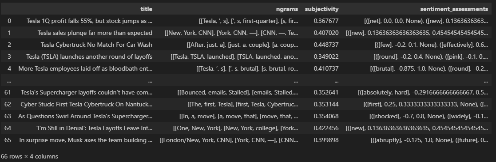
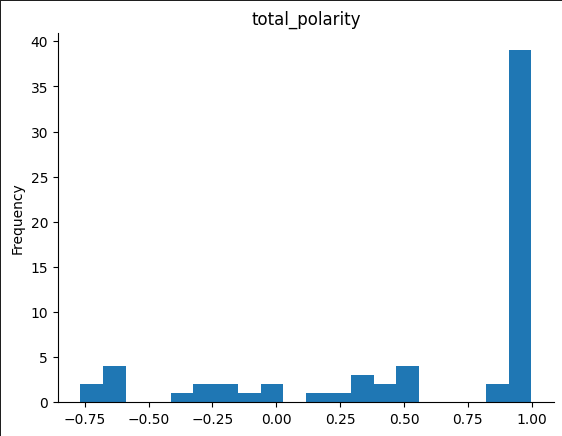
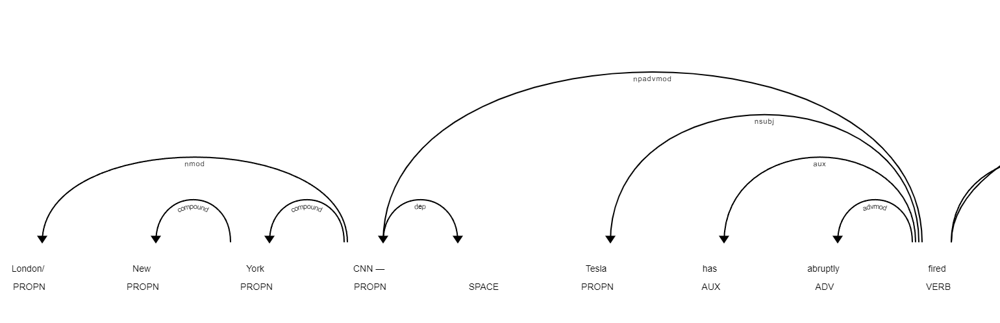

# Sentiment Analysis Project

This project focuses on sentiment analysis of news articles using natural language processing (NLP) techniques and machine learning. It provides tools to analyze the sentiment of news articles and aggregate the sentiment scores to derive insights into whether we should Buy, Hold, or Sell the stocks of the target Company.

## Overview

The project consists of several components:

1. **Data Collection**: News articles are collected from various sources and stored in a structured format. 
    - We utilize the NewsNow and the Google News APIs to pull multiple news sources. 
    - Additionally, we use the NewsPlease scraper to pull news from the links provided by the Google News API since it only provides the links and not the main text of the article.

2. **Preprocessing**: The collected news articles are stored in a dictionary format for readability and usage.
    - The news articles are filtered to reduce bias by limiting amount of articles per publisher to 3 and removing articles with less than 100 tokens.
    - They are then preprocessed to remove noise like stop words, perform lemmatization, and tokenization to prepare them for refined sentiment analysis.

3. **Sentiment Analysis Model**: We utilize the BERT sentiment analysis models to analyze the sentiment of individual news articles.
    - The specific model we use for sentiment analysis is https://huggingface.co/kwang123/bert-sentiment-analysis, which is built upon the bert-base-uncased model.

4. **Sentiment Analysis Methods**: We perform sentiment analysis paragraph by paragraph for each document and then average the scores of all paragraphs within a document to obtain the overall document sentiment.
    - Next, we average the overall documents' sentiment scores to obtain a unweighted sentiment score.
    - We apply higher weights to negative sentiment documents to give them more emphasis compared to the penalized positive sentiment documents to account for the model inaccuracies.
    - We perform the sentiment analysis again using Gemini to compare it with our scoring methodology.

5. **Aggregation**: The sentiment scores obtained from our model and Gemini are aggregated and averaged together. The reason for this is:
    - While Gemini might be consistent in finding the sentiment category of the document, it is insconsistent in scoring the articles. For example, it could score the same article -0.2 first time and -0.4 second time around 
    - While BERT is consistent in scoring the article approximately the same multiple times, it is not always correct in identifying the correct sentiment category 
    - Taking these two big inconsistencies into account, we average the sentiment scores from Gemini and our BERT model to give a final Sentiment score to the list of articles regarding our target company 

6. **Visualization**: We also visualize the structure of each document using spacy to display the ngrams, subjectivity, and obtain the text to parse tree structure.
Data Frama Visualization <br>


Polarity Distribution <br>


Parse Tree <br>



7. **Final Decision**: We return a final score to make a prediction on whether to sell, buy, or hold the stocks of our target company. Our scoring method is:
    - Metric Ranges: 
        - Buy [0.5 - 1] 
        - Hold [0.2 - 0.5] 
        - Sell [-1 to 0.2] 
    - Reason for varying range is because in reality, the more data we have the better. But in this case we are restricted by the amount of articles we are able to extract and process through our endpoints


## How to Run

To run the code
- You need to install all the dependencies, and then define the name of the company that you wish to perform sentiment analysis on. 
- For the NewsNow Endpoint, define the query to the name of the company:
    - ```"query": "<COMPANY>",```
- Do the same for the Google News Endpoint but define the keyword here instead:
    - ```keyword = "<COMPANY>"```
- Additionally, define this section with your API keys:
    - ```GOOGLE_API_KEY='__' ```
    - ``` X_RapidAPI_Key='__' ```


## Contributors

- Sankalp Shubham
- Daniel Kadosh 